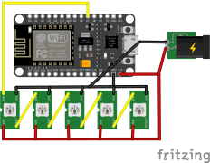

# esp8266_NeoPixelString_balcony

This project runs colorful lighting effects on a 224-LED NeoPixel strip driven by an ESP8266.
author: jaresz https://github.com/jaresz

## Overview
- LED strip: 224 x WS2812/NeoPixel LEDs
- Matrix layout: 32 columns x 7 rows (32x7) using a serpentine (zig-zag) wiring order
	- Top-left is LED 0, top-right is LED 31
	- Row 2 ends at LED 32 on the right (serpentine layout alternates direction each row)

## Animations
- Starfield: moving stars crossing the matrix from left to right.
- Star Warp: first-person perspective warp-through-stars effect.
- Nebula Swirl: rotating colorful nebula/clouds with smooth color shifts.
- Matrix Rain: green "falling characters" (Matrix-style) across the 32x7 matrix.
- Calm Fire: a low-brightness, calm burning fire effect.

These animations are cycled automatically when the device is set to the automatic mode (each runs for approximately 10 seconds).

## Wiring
- Data (middle wire) -> digital pin 13 (GPIO13) on the board (NodeMCU label: D7)
- +5V (power) -> LED V+
- GND -> LED GND
- Important: connect ESP8266 GND and LED strip GND together (common ground)

Wiring diagram:



Notes
- The data pin used in code is `ledStripPin = 13` and the LED count is `ledStripNumpixels = 224` (see `src/main.cpp`).
- Power: 224 NeoPixels can draw significant current at high brightness. Use a capable 5V power supply and avoid powering the strip from the ESP alone.

Build & Upload
- This project is a PlatformIO/Arduino project. Build and upload with PlatformIO in VS Code or run:

```bash
platformio run --target upload
```


## WiFi Configuration
- If the device has no saved WiFi credentials or fails to connect it will start in configuration (AP) mode.
- Access Point SSID: `NeoPixel-Setup` (password: `setup123`). The captive portal is at `http://192.168.4.1` — open a browser and you will be redirected to the setup page.
- Use the web UI to scan for networks, select your WiFi network, enter the password and tap **Save and Connect**. The device will restart and attempt to join the configured network.
- Visual indicators: purple corners pulsing = AP/config mode; blue pulsing corners = attempting to connect; green flash = connected; red flash = connection failed.
- To clear saved WiFi settings and force the device into setup mode, press and hold the config/reset button (GPIO0) for ~5 seconds.

## Web interface

The device hosts a simple web UI (available at its LAN IP) that displays connection status and current animation.
It provides controls for selecting effects, adjusting speed and drawing on LED matrix.


